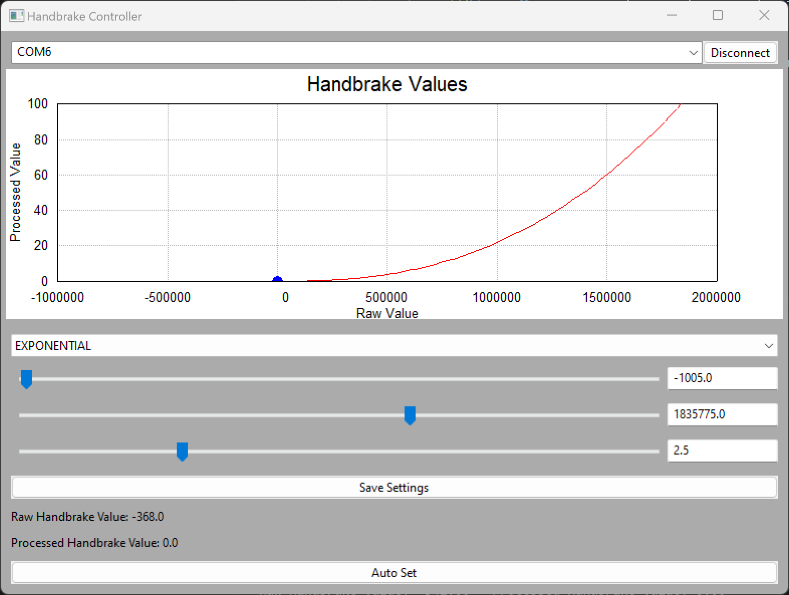

# Handbrake Controller GUI

This project provides a graphical user interface (GUI) for controlling an Arduino-based handbrake. The GUI is implemented in Python using the wxPython library.



This controls the handbrake using the [simrig-controller](https://github.com/andersalavik/simrig-controller)

## Credits

A lot of credits go to ChatGPT and CoPilot for helping me with this project.

## Features

- Selection of curve type (LINEAR, EXPONENTIAL, LOGARITHMIC)
- Adjustment of min/max handbrake values
- Adjustment of curve factor
- Saving settings to EEPROM
- Toggling setup mode
- Displaying raw and processed handbrake values
- Selection of serial port
- Auto Set mode for automatic adjustment of min/max handbrake values

## Requirements

- Python 3.6 or higher
- wxPython 4.1.1 or higher
- pySerial 3.5 or higher

## Installation

1. Clone this repository or download the source code.
2. Install the required Python libraries using pip:

    ```bash
    pip install -r requirements.txt
    ```

3. Run `handbrake_controller.py`:

    ```bash
    python handbrake_controller.py
    ```

## Usage

1. Select the serial port connected to your Arduino.
2. Adjust the handbrake settings as needed.
3. Click 'Save Settings' to save the current settings to EEPROM.
4. Check 'Toggle Setup Mode' to toggle setup mode.
5. Click 'Auto Set' to automatically adjust the min/max handbrake values.

### Auto Set Feature

The "Auto Set" button automatically adjusts the minimum and maximum handbrake values based on the raw handbrake values it receives while in "Auto Set" mode. To use this feature:

1. Click the 'Auto Set' button. It will turn red to indicate that "Auto Set" mode is active.
2. Operate the handbrake through its full range of motion.
3. Click the 'Auto Set' button again to exit "Auto Set" mode. The button will return to its original color, and the minimum and maximum handbrake values will have been adjusted based on the values observed during "Auto Set" mode.

This new feature can help users quickly and accurately set the minimum and maximum values of their handbrake.

## Troubleshooting/FAQ

* **The program throws an error when I try to run it:**

    Restart your controller and try again. If the problem persists, please open an issue on GitHub.

## Contributing

*(Include contribution guidelines here if you want others to contribute to your project)*

## License

This project is licensed under the GNU General Public License v3.0. You can use, modify, and distribute this project, even for commercial purposes. However, you cannot sell it. For more information, see the [LICENSE](LICENSE) file in this repository or visit [https://www.gnu.org/licenses/gpl-3.0.html](https://www.gnu.org/licenses/gpl-3.0.html).
